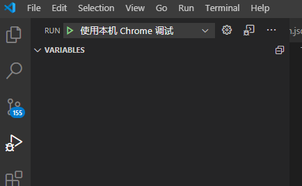

# vscode各种设置  

* 基本设置  
  1.在`File`->`Perferences`->`Settings`中搜索`Render Whitespace`,在下拉框中选择`all`  
    
  2.安装`indent-rainbow`插件,缩进自动彩色，大大提高编程效率  
  3.安装`Rainbow Brackets`插件,括号彩色分组，防止看错括号对  
  
<br/>  
<br/>  

* 设置调试html设置  
  1.VSCode 上装一个插件：`Debugger for Chrome`  
  2.按F5，打开`launch.json`  
  3.插入以下配置  
  ```json
    {
            "name": "使用本机 Chrome 调试",
            "type": "chrome",
            "request": "launch",
            "file": "${workspaceRoot}/index.html",
            // "url": "http://mysite.com/index.html", 
            //使用外部服务器时,请注释掉 file, 改用 url, 并将 useBuildInServer 设置为 false
            "runtimeExecutable": "C:\\Program Files (x86)\\Google\\Chrome\\Application\\chrome.exe", // 改成您的 Chrome 安装路径
            "sourceMaps": true,
            "webRoot": "${workspaceRoot}",
            // "preLaunchTask":"build",
            "userDataDir":"${tmpdir}",
            "port":5433
    }
  ```  
  4.在调试栏下选择`使用本机 Chrome 调试`  
    
  5.按F5就可以调试了  
     
<br/>  
<br/>  

* markdown设置  
  1.安装`Markdown All in One`插件  
  2.安装`Markdown Preview Github Styling`插件  
  3.点击图片上的按钮  
    
  4.实时预览  
    
  
<br/>  
<br/>  

* lua设置  
  1.安装`Lua Language Server coded by Lua`插件  
  2.安装`Luacheck`插件  
  3.在`settings.json`中插入以下配置  
  ```json
    "Lua.diagnostics.severity" : {
      "redefined-local" : "Hint",
      "emmy-lua" : "Hint",
      "undefined-global": "Hint",   //隐藏未定义的全局变量提示
      "lowercase-global": "Hint",
    }
  ```  
  4.在根目录下创建`.luacheckrc`文件,在文件中插入以下代码  
  ```lua
    std = {
      globals = {
        "ClassicCombos",    -- 隐藏未定义的全局变量提示
      }
    }
    max_line_length = 255   -- 单行最大字数
  ```
  
<br/>  
<br/>  

[返回](../home.md)